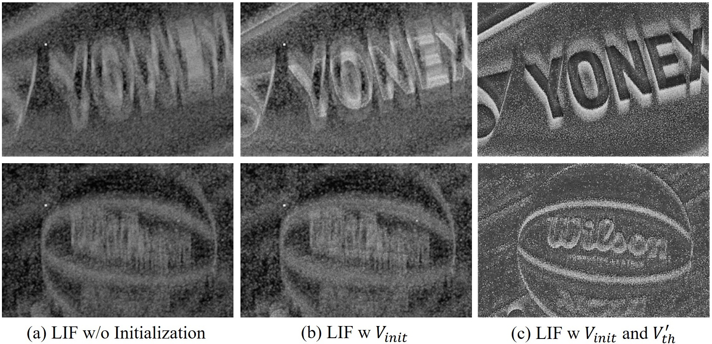

# ClearSight: Human Vision-Inspired Solutions for Event-based Motion Deblurring

[](https://openaccess.thecvf.com/)
[](LICENSE)

This is the official implementation of **ClearSight: Human Vision-Inspired Solutions for Event-based Motion Deblurring**, accepted by ICCV 2025.

📄 **Paper**: [Link to be added]

## 🔥 News
- **[2025]** Code and pretrained models are released!

---

## 📖 Abstract

Event-based cameras have emerged as promising sensors for motion deblurring due to their high temporal resolution and low latency. However, effectively fusing event information with blurry images remains a challenging problem. In this paper, we propose **ClearSight**, a human vision-inspired framework for event-based motion deblurring. Our approach mimics the biological visual system's mechanism to achieve high-quality deblurring results.

---

## 🏗️ Framework

<p align="center">
  
</p>
<p align="center">
  <b>Figure 1: Architecture of ClearSight.</b> The framework consists of event-driven spike processing modules and cross-attention fusion mechanisms.
</p>

---

## 💡 Motivation

<p align="center">
  
</p>
<p align="center">
  <b>Figure 0: Motivation.</b> Comparison between traditional deblurring methods and our event-based approach.
</p>

---

## 📊 Results

### Quantitative Results

<p align="center">
  
</p>
<p align="center">
  <b>Table 1: Quantitative comparison on benchmark datasets.</b> Our method achieves state-of-the-art performance on GOPRO, REBlur, and MS-RBD datasets.
</p>

### Qualitative Results

#### GOPRO Dataset
<p align="center">
  
</p>
<p align="center">
  <b>Visual results on GOPRO dataset.</b>
</p>

#### REBlur Dataset
<p align="center">
  
</p>
<p align="center">
  <b>Visual results on REBlur dataset.</b>
</p>

#### MS-RBD Dataset
<p align="center">
  
</p>
<p align="center">
  <b>Visual results on MS-RBD dataset.</b>
</p>

---

## 🔬 Ablation Studies

<p align="center">
  
</p>
<p align="center">
  <b>Ablation study on Region-Based Attention Module (RBAM).</b>
</p>

<p align="center">
  
</p>
<p align="center">
  <b>Ablation study on different loss functions.</b>
</p>

<p align="center">
  
</p>
<p align="center">
  <b>Visualization of ablation study results.</b>
</p>

---

## 🚀 Getting Started

### Prerequisites

- Python 3.8+
- CUDA 11.0+
- PyTorch 1.10+

### Installation

1. Clone the repository:
```bash
git clone https://github.com/your-username/ClearSight.git
cd ClearSight
```

2. Install dependencies:
```bash
pip install -r requirements.txt
```

### Dataset Preparation

Please organize your dataset in the following structure:
```
dataset/
├── train/
│   ├── blur/
│   ├── event/
│   └── gt/
└── test/
    ├── blur/
    ├── event/
    └── gt/
```

### Training

```bash
python train.py --train_path /path/to/train --val_path /path/to/val --save_path ./checkpoint/gopro/
```

### Inference

```bash
python inference.py
```

---

## 📁 Project Structure

```
ClearSight/
├── train.py                    # Training script
├── inference.py                # Inference script
├── dataloader.py               # Data loading utilities
├── metrics.py                  # Loss functions
├── checkpoint/                 # Pretrained models
│   └── gopro/
│       └── gopro_ckpt.pth
├── models/
│   ├── Model_gpu.py            # Main model architecture
│   ├── layers_gpu.py           # Basic layer definitions
│   ├── Attention_fusion.py     # Attention fusion modules
│   └── neuron_gpu.py           # Custom spiking neuron
└── Figure/                     # Paper figures
```

---

## 📋 Requirements

See [requirements.txt](requirements.txt) for the list of dependencies.

---

## 📝 Citation

If you find this work helpful for your research, please consider citing our paper:

```bibtex
@inproceedings{clearsight2025,
  title={ClearSight: Human Vision-Inspired Solutions for Event-based Motion Deblurring},
  author={Anonymous},
  booktitle={Proceedings of the IEEE/CVF International Conference on Computer Vision (ICCV)},
  year={2025}
}
```

---

## 🙏 Acknowledgements

[To be added]

---

## 📄 License

This project is released under the MIT License. See [LICENSE](LICENSE) for more details.

---

## 📧 Contact

If you have any questions, please feel free to open an issue or contact the authors.

---

<p align="center">
  <a href="https://openaccess.thecvf.com/">📄 Paper</a> | 
  <a href="https://github.com/your-username/ClearSight">💻 Code</a> | 
  <a href="https://github.com/your-username/ClearSight/issues">❓ Issues</a>
</p>