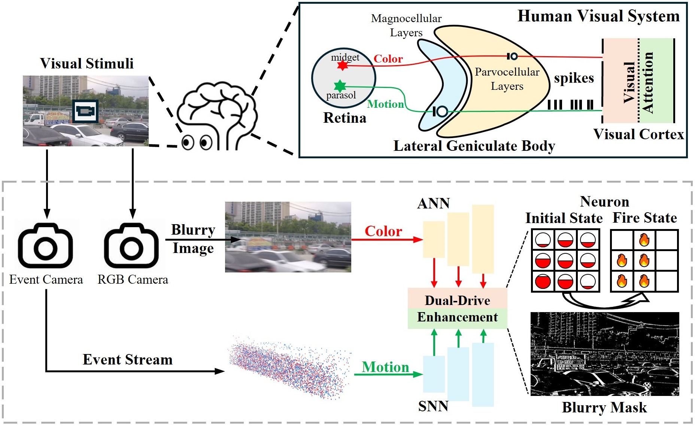
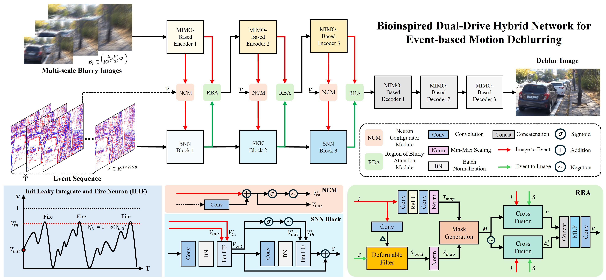
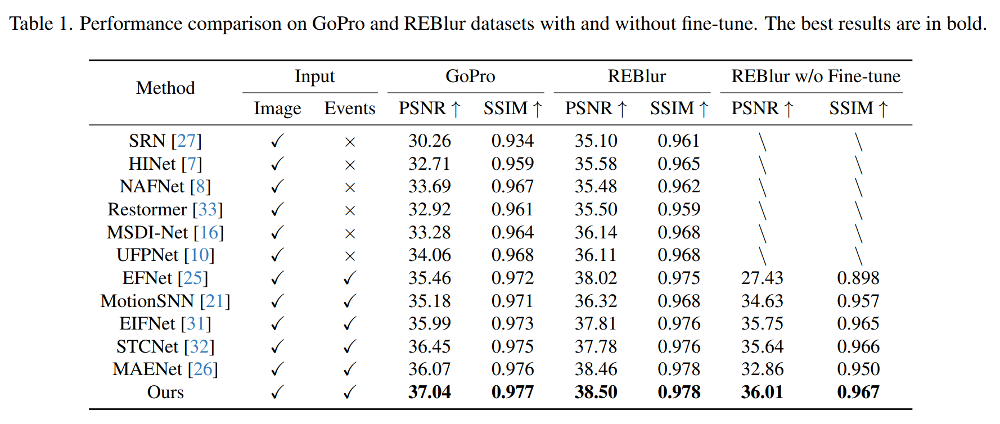
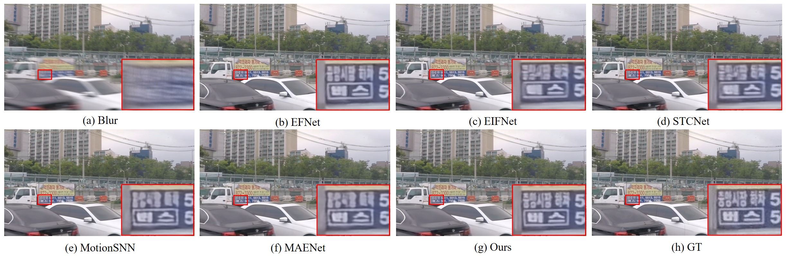
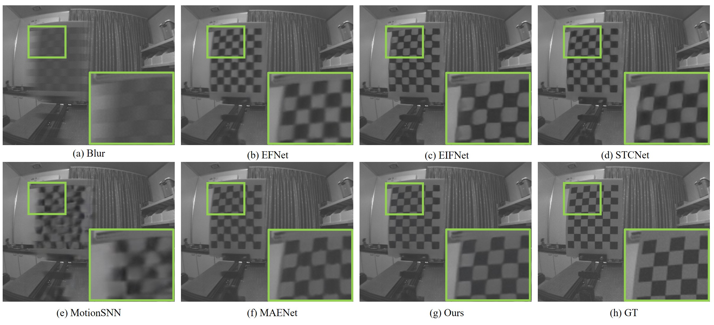
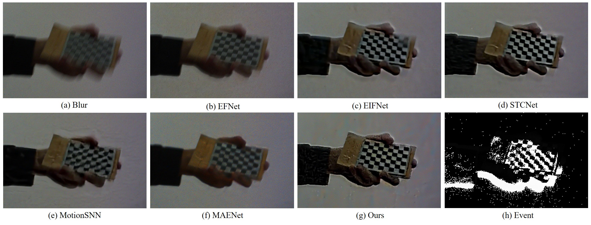
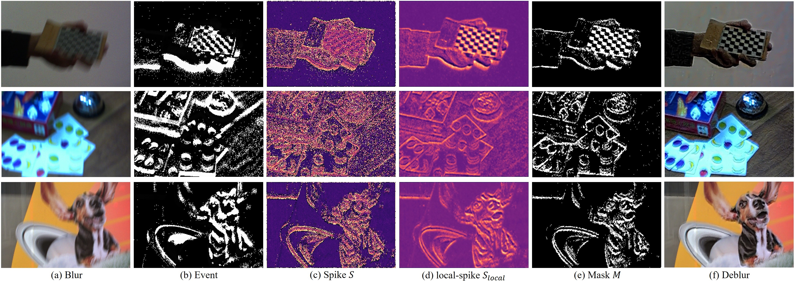
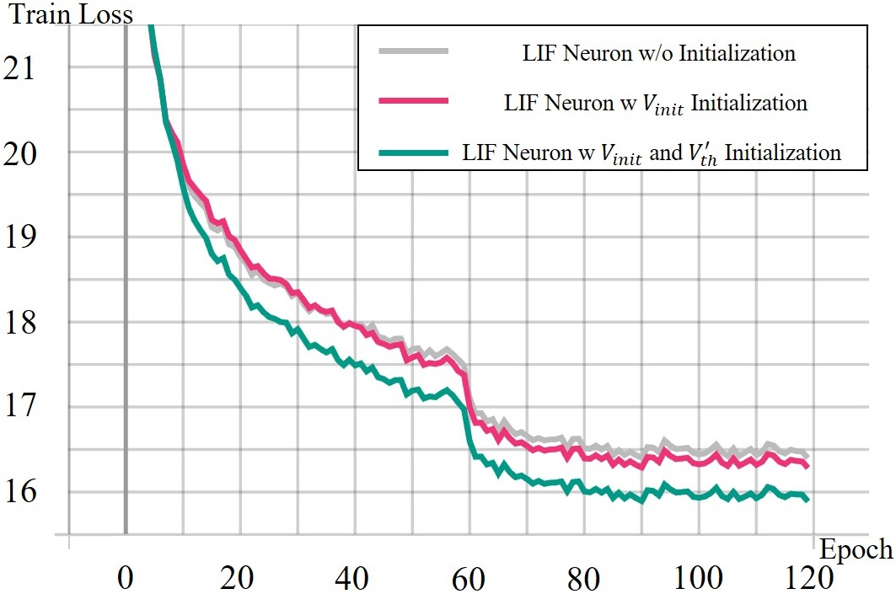

# ClearSight: Human Vision-Inspired Solutions for Event-based Motion Deblurring

[](https://openaccess.thecvf.com/)
[](LICENSE)

This is the official implementation of **ClearSight: Human Vision-Inspired Solutions for Event-based Motion Deblurring**, accepted by **ICCV 2025**.

**Authors**: Xiaopeng Lin, Yulong Huang, Hongwei Ren, Zunchang Liu, Hongxiang Huang, Yue Zhou, Haotian Fu, Bojun Cheng
**Affiliation**: The Hong Kong University of Science and Technology (Guangzhou)

📄 **Paper**: [https://openaccess.thecvf.com/content/ICCV2025/html/Lin_ClearSight_Human_Vision-Inspired_Solutions_for_Event-Based_Motion_Deblurring_ICCV_2025_paper.html]

## 🔥 News
- **[2025]** Code and pretrained models are released!

---

## 📖 Abstract

Motion deblurring addresses the challenge of image blur caused by camera or scene movement. Event cameras provide motion information encoded in asynchronous event streams. To efficiently leverage the temporal information of event streams, we employ Spiking Neural Networks (SNNs) for motion feature extraction and Artificial Neural Networks (ANNs) for color information processing.

Inspired by the visual attention mechanism in the human visual system, this study introduces a **Bioinspired Dual-Drive Hybrid Network (BDHNet)**. Specifically:
* The **Neuron Configurator Module (NCM)** is designed to dynamically adjust neuron configurations based on cross-modal features, focusing spikes in blurry regions.
* The **Region of Blurry Attention Module (RBAM)** is introduced to generate a blurry mask in an unsupervised manner, effectively extracting motion clues and guiding accurate cross-modal feature fusion.

Extensive evaluations demonstrate that our method outperforms current state-of-the-art methods on synthetic and real-world datasets.

---

## 🏗️ Method: BDHNet

Our approach mimics the human visual system, processing visual stimuli hierarchically as color (via ANN) and motion (via SNN).

<p align="center">
  
</p>
<p align="center">
  <b>Figure 1: The working mechanism of the human visual system and the proposed Bioinspired Dual-Drive Hybrid Network (BDHNet).</b>
</p>


### Network Architecture

The framework adopts an encoder-decoder architecture. The **NCM** performs visual enhancement from image to event (Neuron-based Attention), while the **RBAM** performs visual enhancement from event to image (Synapse-based Attention).

<p align="center">
  
</p>
<p align="center">
  <b>Figure 2: The overall framework of BDHNet.</b> The event stream is processed into a voxel-based representation. NCM dynamically configures SNN neurons, and RBAM generates a mask for blurry regions to guide fusion.
</p>

---

## 📊 Results

Our BDHNet achieves SOTA performance on **GoPro**, **REBlur**, and **MS-RBD** datasets.

### Quantitative Comparison
<p align="center">
  
</p>
<p align="center">
  <b>Table 1: Performance comparison on GoPro and REBlur datasets.</b> Our method achieves the highest PSNR/SSIM, showing superior ability to mitigate blur effects.
</p>

### Qualitative Comparison (Click to Expand)

<details>
<summary><b>🖼️ GoPro Dataset Results (Synthetic)</b></summary>
<br>
<p align="center">
  
</p>
<p align="center">
  <b>Figure 3: Qualitative comparisons on GoPro dataset.</b> Our method excels in restoring sharper text and finer structural details compared to EFNet, MotionSNN, and others.
</p>
</details>

<details>
<summary><b>🖼️ REBlur Dataset Results (Real-World)</b></summary>
<br>
<p align="center">
  
</p>
<p align="center">
  <b>Figure 4: Qualitative comparisons on REBlur dataset.</b> Even without fine-tuning, our model demonstrates robust generalization in real-world blurry scenarios.
</p>
</details>

<details>
<summary><b>🖼️ MS-RBD Dataset Results(Real-World)</b></summary>
<br>
<p align="center">
  
</p>
<p align="center">
  <b>Figure 5: Visual results on real-world MS-RBD dataset.
</p>
</details>

---

## 🔬 Ablation Studies

[cite_start]We conduct comprehensive ablation studies to validate the effectiveness of the proposed modules [cite: 320-321].

<details>
<summary><b>📉 Visualizations: RBAM & Loss Analysis (Click to Expand)</b></summary>
<br>

### 1. Effectiveness of RBAM
<p align="center">
  
</p>
<p align="center">
  [cite_start]<b>Figure 7: Effectiveness of the Region of Blurry Attention Module (RBAM).</b> The RBAM generates a mask that specifically targets blurry regions, improving feature fusion accuracy.
</p>

<br>

### 2. Training Convergence (NCM)
<p align="center">
  
</p>
<p align="center">
  [cite_start]<b>Figure 8: Training loss comparison.</b> The NCM initialization (Green line) leads to faster convergence and lower training loss compared to methods without initialization (Grey line).
</p>

</details>

---

## 🚀 Getting Started

### Prerequisites

- Python 3.8+
- PyTorch 1.10+
- CUDA 11.0+

### Installation

```bash
git clone [https://github.com/xplin13/ICCV-2025-ClearSight-Human-Vision-Inspired-Solutions-for-Event-based-Motion-Deblurring.git](https://github.com/xplin13/ICCV-2025-ClearSight-Human-Vision-Inspired-Solutions-for-Event-based-Motion-Deblurring.git)
cd ClearSight
pip install -r requirements.txt
```


### Dataset Preparation

Please organize your dataset in the following structure:
```
dataset/
├── train/
│   ├── blur/
│   ├── event/
│   └── gt/
└── test/
    ├── blur/
    ├── event/
    └── gt/
```

### Training

```bash
python train.py --train_path /path/to/train --val_path /path/to/val --save_path ./checkpoint/gopro/
```

### Inference

```bash
python inference.py
```

---

## 📁 Project Structure

```
ClearSight/
├── train.py                    # Training script
├── inference.py                # Inference script
├── dataloader.py               # Data loading utilities
├── metrics.py                  # Loss functions
├── checkpoint/                 # Pretrained models
│   └── gopro/
│       └── gopro_ckpt.pth
├── models/
│   ├── Model_gpu.py            # Main model architecture
│   ├── layers_gpu.py           # Basic layer definitions
│   ├── Attention_fusion.py     # Attention fusion modules
│   └── neuron_gpu.py           # Custom spiking neuron
└── Figure/                     # Paper figures
```

---

## 📋 Requirements

See [requirements.txt](requirements.txt) for the list of dependencies.

---

## 📝 Citation

If you find this work helpful for your research, please consider citing our paper:

```bibtex
@inproceedings{lin2025clearsight,
  title={ClearSight: Human vision-inspired solutions for event-based motion deblurring},
  author={Lin, Xiaopeng and Huang, Yulong and Ren, Hongwei and Liu, Zunchang and Huang, Hongxiang and Zhou, Yue and Fu, Haotian and Cheng, Bojun},
  booktitle={Proceedings of the IEEE/CVF International Conference on Computer Vision},
  pages={7462--7471},
  year={2025}
}
```

---

## 👏 Acknowledgements

We appreciate the open-source code and datasets from the following projects:

* **Code**: [MIMO-UNet](https://github.com/chosj95/MIMO-UNet), [EFNet](https://github.com/AHupuJR/EFNet)
* **Datasets**: [EIFNet](https://github.com/wyang-vis/EIFNet) (GoPro), [EFNet](https://github.com/AHupuJR/EFNet) (REBlur), [GEM](https://github.com/XiangZ-0/GEM) (MS-RBD).
---

## 📄 License

This project is released under the MIT License. See [LICENSE](LICENSE) for more details.

---

## 📧 Contact

If you have any questions, please feel free to open an issue or contact the authors.

---

<p align="center">
  <a href="https://openaccess.thecvf.com/">📄 Paper</a> | 
  <a href="https://github.com/xplin13/ICCV-2025-ClearSight-Human-Vision-Inspired-Solutions-for-Event-based-Motion-Deblurring">💻 Code</a> | 
  <a href="https://github.com/xplin13/ICCV-2025-ClearSight-Human-Vision-Inspired-Solutions-for-Event-based-Motion-Deblurring/issues">❓ Issues</a>
</p>